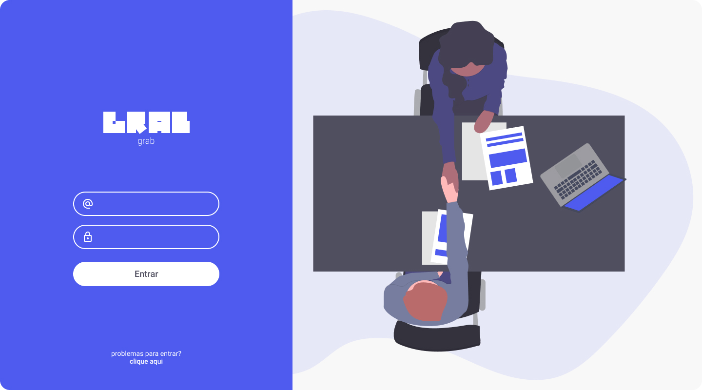

  
  <h3 align="center">Grab - Página de login</h3>

  <a href="https://github.com/magdielndantas/grab-pagina-de-login">Desafio</a> | 
  <a href="https://www.linkedin.com/in/magdielndantas/">Contato</a>

## DevChallenge
[DevChallenge](https://devchallenge.com.br/) permite que você evolua suas skills como programador!

## Desafio
Seu desafio será criar uma página de login e verificar se o formulário foi preenchido corretamente.

## Tecnologias
HTML

CSS

Javascript

## Como começar
1 - Use esse template (clicando em Use this template) ou faça um fork deste repositório com o código inicial

2 - Leia as instruções no readme.md

3 - Comece a codar!

4 - Compartilhe seu resultado com a comunidade :)

## Requisitos
- Sua página deve se parecer o mais próximo possível do design

- Sua página deve ser responsiva

## Design
Modelo está disponível na pasta ./design

Imagens estão disponíveis na pasta ./assets

O layout pode ser visto e copiado diretamente do Figma [clicando aqui](https://www.figma.com/file/QYQm17sJV0ZhviTGOa1jmZ/Untitled?node-id=0%3A1). Nesse arquivo, você pode exportar imagens e ícones como desejar.

### Cores
Azul: #4E5BEE

Vermelho: #FF5757

Cinza: #F8F8F8

### Fonte
[Roboto](https://fonts.google.com/specimen/Roboto)

## Icones
[Material Icons(outline)](https://material.io/resources/icons/?style=outline)

## Compartilhe
1 - Inicie seu projeto utilizando esse template no seu github como um repositório público

2 - Faça um print, gif ou vídeo e compartilhe o resultado no seu Linkedin

3 - Você tambm pode adicionar uma "issue" neste repositório mostrando seu resultado final

Também pode me enviar um feedback pelo [LinkedIn](https://www.linkedin.com/in/magdielndantas)!

Desafio criado por [Magdiel Dantas](https://github.com/magdielndantas)
